<a href="mailto:sprajyesh@gmail.com">sprajyesh@gmail.com</a> &nbsp;·&nbsp;
<a href="https://www.linkedin.com/in/surya-prajyesh-3053ab253/">LinkedIn</a> &nbsp;·&nbsp;
Houston, Texas &nbsp;·&nbsp;
open to internships and full-time roles, remote or on-site

## 1 &nbsp; Introduction

I like the moment a spreadsheet becomes a system. Most of what I build follows one pattern: gather the data, apply rules a person can read, let a model handle the judgement calls, and leave the final say to a human. The three projects below are the clearest examples. Each one has a figure, and the numbers come from the project itself.

## 2 &nbsp; Selected work

### 2.1 &nbsp; Job Alerts: screening 10,000+ postings a day

**Figure 1.** The Job Alerts pipeline. Postings from five sources go through cheap, readable rule filters first (experience level, visa sponsorship, degree). Only the survivors are ranked by an LLM. Drafted answers draw on a memory profile that improves every time I correct one.[^1]

Python · Claude API · Flask · Playwright · Task Scheduler &nbsp;—&nbsp; [repository →](https://github.com/suryatenz/job-alerts)

### 2.2 &nbsp; Pit Wall: 74 years of Formula 1 and a race predictor

**Figure 2.** How often the pole-sitter goes on to win, season by season, computed from the dataset Pit Wall is built on. Across 1,125 races the answer is 42.6%, and 21.5% of wins came from outside the top three on the grid. Starting position matters but settles far less than you would expect, which is what makes prediction interesting. Pit Wall covers 861 drivers with a Random Forest race predictor that gives confidence scores, a championship what-if simulator and head-to-head driver comparison.

FastAPI · scikit-learn · pandas · React · Recharts &nbsp;—&nbsp; [repository →](https://github.com/suryatenz/Pit-Wall)

### 2.3 &nbsp; Seismic salt segmentation (published)

**Figure 3.** Schematic of the UNet approach from my paper [1]: an encoder compresses the seismic image, a decoder rebuilds it at full resolution, and skip connections carry fine detail across so the salt boundary stays sharp. The panels are illustrative, not model output.

Python · TensorFlow · UNet &nbsp;—&nbsp; [repository →](https://github.com/suryatenz/Salt_segmentation)

### 2.4 &nbsp; Also

**[OwlPost](https://github.com/suryatenz/OwlPost)**: schedules and sends 70–100 personalised outreach emails a day over Gmail SMTP, recycles the contact list when a run finishes, and detects replies over IMAP with multi-method matching.

## 3 &nbsp; Experience

<b>Table 1.</b> Internships, most recent first.

| Year | Role | Organisation | What I did |
|:--|:--|:--|:--|
| 2026 | AI Automation & Data Analytics Intern | Diversified Medical Practices, Houston | Replaced paper-based clinic admin with Python automation for service requests and scheduling |
| 2024 | Data Visualization Developer Intern | UnBoxing Community, Bangalore | React portal over REST APIs and a Java backend that turned raw data into dashboards; AWS and Git deployments |
| 2023 | Web Development Intern | EduMoon, remote | Production pages in HTML, CSS and JavaScript with the frontend team |

## 4 &nbsp; Methods and materials

<b>Table 2.</b> Tools I have shipped work with.

| | |
|:--|:--|
| *Modelling* | Python, SQL, pandas, NumPy, scikit-learn, TensorFlow |
| *LLM systems* | Claude API, prompt pipelines, memory profiles |
| *Serving* | FastAPI, Flask, Docker, AWS S3 |
| *Interfaces* | React, Redux, Vite, Tailwind, Framer Motion, Recharts |
| *Automation* | Playwright, Gmail SMTP / IMAP, Windows Task Scheduler |
| *Reporting* | Power BI, Tableau, Matplotlib, Jupyter |

## 5 &nbsp; Activity

**Figure 4.** Weekly public contributions over the last year. A GitHub Action redraws this figure every day.

## References

1. *Deep Learning for Seismic Salt Segmentation to Aid Hydrocarbon Exploration Using UNet.* Published June 2025.
2. MS, Engineering Data Science & AI, University of Houston, 2025 to present.
3. *Python for Data Science, AI & Development.* IBM, Coursera, 2023.

[^1]: Playwright pre-fills real application forms but always stops before submitting, and never touches demographic fields. A person presses the button.
