&nbsp;&nbsp;&nbsp;

## 01 &nbsp;Abstract

I like the moment a spreadsheet becomes a system. Most of what I build follows one pattern: gather the data, apply rules a person can read, let a model handle the judgement calls, and leave the final say to a human. Below are the three clearest examples, each with a figure. The numbers come from the projects themselves.

## 02 &nbsp;Selected work

**Figure 1 · Job Alerts.** Postings from five sources go through cheap, readable rule filters first (experience level, visa sponsorship, degree). Only the survivors reach the LLM. Drafted answers draw on a memory profile that improves every time I correct one.[^1]
 Python · Claude API · Flask · Playwright · Task Scheduler &nbsp;·&nbsp; **[repository ↗](https://github.com/suryatenz/job-alerts)**

 

**Figure 2 · Pit Wall.** How often the pole-sitter goes on to win, season by season, computed from the dataset Pit Wall is built on. Across 1,125 races it's 42.6%, and 21.5% of wins came from outside the top three on the grid. Starting position matters, but far less than you'd guess, which is what makes prediction interesting. Pit Wall covers 861 drivers with a Random Forest race predictor that gives confidence scores, a championship what-if simulator and head-to-head driver comparison.
 FastAPI · scikit-learn · pandas · React · Recharts &nbsp;·&nbsp; **[repository ↗](https://github.com/suryatenz/Pit-Wall)**

 

**Figure 3 · Salt segmentation.** The UNet approach from my published paper [1]. An encoder compresses the seismic image, a decoder rebuilds it at full resolution, and skip connections carry fine detail across so the salt boundary stays sharp. The panels are illustrative, not model output.
 Python · TensorFlow · UNet &nbsp;·&nbsp; **[repository ↗](https://github.com/suryatenz/Salt_segmentation)**

 

## 03 &nbsp;Experience

| | Role | Where | What I did |
|:--|:--|:--|:--|
| **2026** | AI Automation & Data Analytics Intern | Diversified Medical Practices, Houston | Replaced paper-based clinic admin with Python automation for service requests and scheduling |
| **2024** | Data Visualization Developer Intern | UnBoxing Community, Bangalore | React portal over REST APIs and a Java backend that turned raw data into dashboards; AWS and Git deployments |
| **2023** | Web Development Intern | EduMoon, remote | Production pages in HTML, CSS and JavaScript with the frontend team |
| **now** | MS, Engineering Data Science & AI | University of Houston | Data analysis, statistical modelling, data visualisation, applied machine learning |

## 04 &nbsp;Toolkit

| | |
|:--|:--|
| **Modelling** | Python · SQL · pandas · NumPy · scikit-learn · TensorFlow |
| **LLM systems** | Claude API · prompt pipelines · memory profiles |
| **Serving** | FastAPI · Flask · Docker · AWS S3 |
| **Interfaces** | React · Redux · Vite · Tailwind · Framer Motion · Recharts |
| **Automation** | Playwright · Gmail SMTP / IMAP · Windows Task Scheduler |
| **Reporting** | Power BI · Tableau · Matplotlib · Jupyter |

## 05 &nbsp;Activity

## References

1. *Deep Learning for Seismic Salt Segmentation to Aid Hydrocarbon Exploration Using UNet.* June 2025. [Confirmation letter](https://drive.google.com/file/d/1s0GuPYKE_LXVslNYWUAj2C8-hv6Kpzco/view?usp=drive_link) · [Certificate](https://drive.google.com/file/d/1gSoNVflO0YdUQqLdb_eBR5Z-5OCAKthk/view?usp=sharing)
2. *Python for Data Science, AI & Development.* IBM, Coursera, 2023.
3. Portfolio: [surya-prajyesh.vercel.app](https://surya-prajyesh.vercel.app) · Résumé: [PDF](https://github.com/suryatenz/suryatenz/blob/main/resume/Surya_Prajyesh_Eatha_Resume.pdf)

[^1]: Playwright pre-fills real application forms but always stops before submitting, and never touches demographic fields. A person presses the button.
